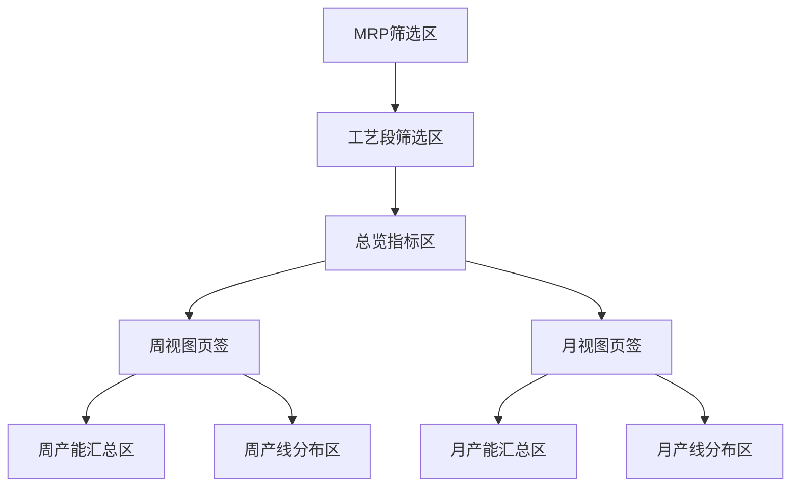

# DESIGN_product-line-overview

## 设计目标

把 `/product-line` 设计成一个以工艺段为主轴的分析页面，让用户在一个页面内完成：

1. 选择数据版本
2. 按工艺段筛选产线
3. 查看该工艺段的周汇总利用率
4. 查看该工艺段的月汇总利用率
5. 快速定位超载线、低载线和波动线

## 页面结构



## 信息架构

### 1. MRP筛选区

复用现有静态核算页的三级筛选：

- 导入人
- 文件
- 版本

行为：

- 用户选定版本后，页面并行加载周、月两套静态核算数据。
- 若任一接口失败，在对应区域显示错误态，不阻塞另一部分原型结构。

### 2. 工艺段筛选区

数据来源：

- `Object.keys(linesData)` 中每条 `lineCode` 的前三位。

展示形式：

- 横向分段按钮或标签组
- 默认包含 `全部`
- 点击后刷新当前工艺段下所有图表和明细

行为规则：

- `全部`：展示所有工艺段整体情况
- 单个工艺段：仅展示该工艺段下产线

### 3. 总览指标区

建议 4 个核心卡片：

1. 周平均利用率
2. 月平均利用率
3. 周峰值利用率
4. 超载产线数

计算口径：

- 周平均利用率：当前工艺段所有产线、所有周的 `loading` 均值
- 月平均利用率：当前工艺段所有产线、所有月的 `loading` 均值
- 周峰值利用率：当前工艺段所有产线、所有周中的最大 `loading`
- 超载产线数：在任意周或月出现 `loading > 1` 的去重产线数

## 图表设计

### 周视图

周视图单独展示，不与月图表上下混排。

包含两个主要区块：

- 周产能汇总区
- 周产线分布区

### 周产能汇总区

#### 图表 A：工艺段周利用率趋势

形式：

- 柱线混合图

编码：

- 柱：工艺段在每周的总需求量
- 线：工艺段在每周的平均利用率

价值：

- 同时看到需求变化和负荷变化

#### 图表 B：工艺段下产线周平均利用率排名

形式：

- 横向条形图

编码：

- Y 轴：产线
- X 轴：周平均利用率

价值：

- 快速识别高负荷线和低负荷线

#### 图表 C：产线 x 周热力矩阵

形式：

- 热力矩阵

编码：

- 行：产线
- 列：周
- 色深：利用率

价值：

- 一眼看出异常周和异常线

### 月视图

月视图单独展示，不与周图表上下混排。

包含两个主要区块：

- 月产能汇总区
- 月产线分布区

### 月产能汇总区

#### 图表 D：工艺段月利用率趋势

形式：

- 柱线混合图

编码：

- 柱：工艺段在每月的总需求量
- 线：工艺段在每月的平均利用率

#### 图表 E：工艺段下产线月平均利用率排名

形式：

- 横向条形图

#### 图表 F：产线 x 月热力矩阵

形式：

- 热力矩阵

## 原型草图

```text
┌────────────────────────────────────────────────────────────────────┐
│ 产线一览                                                           │
├────────────────────────────────────────────────────────────────────┤
│ [导入人] [文件] [版本] [加载数据]                                   │
├────────────────────────────────────────────────────────────────────┤
│ 工艺段: [全部] [SMT] [DIP] [FAL] [AST] ...                        │
├────────────────────────────────────────────────────────────────────┤
│ [周] [月]                                                         │
├────────────────────────────────────────────────────────────────────┤
│ [平均利用率] [峰值利用率] [产线数] [超载产线数]                     │
├───────────────────────┬────────────────────────────────────────────┤
│ 利用率趋势             │ 利用率排名                                  │
│ 柱+线                  │ 横向条形图                                  │
├───────────────────────┴────────────────────────────────────────────┤
│ 热力矩阵                                                         │
└────────────────────────────────────────────────────────────────────┘
```

## 数据映射设计

### 输入接口

- 周接口：
  - `lines`
  - `weeks`
  - `weekDates`
- 月接口：
  - `lines`
  - `months`
  - `monthDates`
- 产线接口：
  - `lineCode`
  - `lineName`

### 页面中间层数据结构

建议在前端构造三个层级：

1. `rawWeeklyLines`
   - 原始周数据
2. `rawMonthlyLines`
   - 原始月数据
3. `groupedByProcess`
   - 以工艺段为 key 的聚合结果

示意：

```js
{
  SMT: {
    lineCodes: ['SMT1001N', 'SMT1002N'],
    weekly: {
      dates: [...],
      totalDemandByDate: {...},
      avgLoadingByDate: {...},
      lineAvgLoading: [...]
    },
    monthly: {
      dates: [...],
      totalDemandByDate: {...},
      avgLoadingByDate: {...},
      lineAvgLoading: [...]
    }
  }
}
```

## 交互设计

### 主交互流

1. 用户进入页面
2. 选择导入人、文件、版本
3. 点击加载数据
4. 页面并行请求周/月数据
5. 页面自动提取工艺段
6. 默认选中 `全部` 或第一个工艺段
7. 切换工艺段时，仅刷新前端聚合结果，不重新请求接口

### 状态设计

- 初始态：提示先选择版本
- 加载态：周/月区块 skeleton 或 loading
- 空态：当前工艺段无数据
- 错误态：接口错误或解析失败

## 技术实现建议

### 前端实现路径

优先复用：

- 现有 MRP 筛选逻辑
- 现有 `getCapacityAssessment`
- 现有 `getCapacityAssessmentMonthly`
- 现有 `getLines`

建议新增：

- `useProductLineOverview` 之类的组合式逻辑层，负责：
  - 拉取周/月数据
  - 聚合工艺段
  - 计算图表数据
  - 输出异常列表

### 图表实现建议

当前仓库没有现成图表依赖。

正式实现已确认允许新增图表库。

建议直接引入成熟图表库，用于：

1. 柱线混合趋势图
2. 横向排名条形图
3. 热力矩阵

## 质量门控

Architect 阶段完成标准：

- 页面结构清晰
- 数据来源与现有架构一致
- 无需新增后端接口
- 图表职责边界明确
- 交互流和状态流完整

## 已审批结果

已确认：

1. 页面按“周、月分开展示”走，建议通过页签切换，而不是一个长页面上下堆叠。
2. 不保留“异常提示 / 汇总明细”区。
3. 正式实现允许新增图表库。
