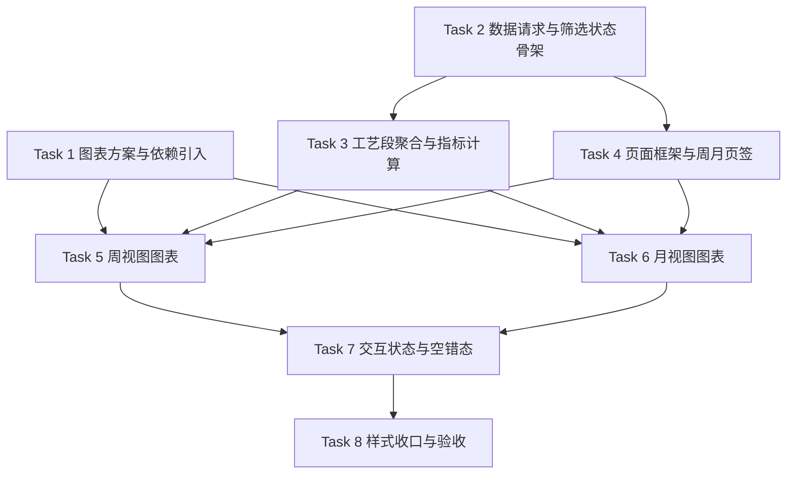

# TASK_product-line-overview

## 目标

将“产线一览”页面拆分为可独立实施、可独立验证的原子任务，确保正式实现时可以按依赖顺序推进，并在每个阶段快速验证结果。

## 任务依赖图

## 原子任务

### Task 1 图表方案与依赖引入

目标：
- 选定并接入正式实现所需的图表库

输入契约：
- 已批准允许新增图表库
- 当前前端技术栈为 Vue 3 + Vite

输出契约：
- `package.json` 新增图表依赖
- 明确统一的图表封装策略

实现约束：
- 优先选择对 Vue 3 支持成熟、同时覆盖折线/柱状/条形/热力图的方案
- 不引入多套重叠图表库

建议方案：
- `echarts`
- `vue-echarts`

验收标准：
- 依赖安装成功
- 能在页面中渲染最小可用图表实例

依赖关系：
- 前置：无
- 后置：Task 5、Task 6

### Task 2 数据请求与筛选状态骨架

目标：
- 复用现有 MRP 筛选逻辑和接口请求，建立本页的数据入口

输入契约：
- 周接口 `getCapacityAssessment`
- 月接口 `getCapacityAssessmentMonthly`
- 产线接口 `getLines`

输出契约：
- 页面基础状态：
  - 导入人
  - 文件
  - 版本
  - 加载状态
  - 原始周数据
  - 原始月数据
  - 产线名称映射

实现约束：
- 不新增后端接口
- 尽量复用现有静态核算页的筛选模式
- 周/月数据并行拉取

验收标准：
- 选择版本后能同时拿到周、月、产线名称三类数据
- 任意一种请求失败时，错误状态可被页面消费

依赖关系：
- 前置：无
- 后置：Task 3、Task 4

### Task 3 工艺段聚合与指标计算

目标：
- 将原始按产线数据聚合为“工艺段视图 + 图表消费数据”

输入契约：
- 周原始 `lines + weeks + weekDates`
- 月原始 `lines + months + monthDates`
- 产线名称映射

输出契约：
- `processOptions`
- `selectedProcess`
- `groupedByProcess`
- 周视图指标数据
- 月视图指标数据
- 周趋势、排名、热力图数据
- 月趋势、排名、热力图数据

实现约束：
- 工艺段固定取 `lineCode.substring(0, 3)`
- 支持 `全部` 工艺段
- 聚合函数与视图组件分离，避免把统计逻辑写死在模板中

验收标准：
- 任一工艺段都能正确得到：
  - 平均利用率
  - 峰值利用率
  - 产线数
  - 超载产线数
- 周/月图表数据结构完整且无空字段错误

依赖关系：
- 前置：Task 2
- 后置：Task 5、Task 6

### Task 4 页面框架与周月页签

目标：
- 建立页面基础布局和周/月切换结构

输入契约：
- 页面结构设计文档
- 筛选区与工艺段区需求已确认

输出契约：
- `/product-line` 页面骨架
- 顶部筛选区
- 工艺段切换区
- 周/月页签
- 指标卡片区和图表容器区

实现约束：
- 周、月必须分开展示
- 不保留异常提示区
- 不保留汇总明细区
- 优先复用现有全局样式变量和按钮/select 组件

验收标准：
- 页面骨架完整
- 页签切换正常
- 各图表区位预留明确

依赖关系：
- 前置：Task 2
- 后置：Task 5、Task 6

### Task 5 周视图图表

目标：
- 完成周视图下的三张图

输入契约：
- 周聚合数据
- 图表库已接入
- 页面周视图区容器已就绪

输出契约：
- 周利用率趋势图
- 周产线排名图
- 周热力矩阵

实现约束：
- 指标卡片与图表都消费同一套周聚合结果
- 图表配置与样式保持一致
- 周日期标签优先使用 `weekDates`

验收标准：
- 切换工艺段时三张图同步刷新
- 图例、坐标、tooltip 表意清晰
- 无数据时能显示空态

依赖关系：
- 前置：Task 1、Task 3、Task 4
- 后置：Task 7

### Task 6 月视图图表

目标：
- 完成月视图下的三张图

输入契约：
- 月聚合数据
- 图表库已接入
- 页面月视图区容器已就绪

输出契约：
- 月利用率趋势图
- 月产线排名图
- 月热力矩阵

实现约束：
- 月标签优先使用 `monthDates`
- 周/月视图组件结构尽量对称，便于维护

验收标准：
- 切换工艺段时三张图同步刷新
- 图表数据与月聚合结果一致
- 无数据时能显示空态

依赖关系：
- 前置：Task 1、Task 3、Task 4
- 后置：Task 7

### Task 7 交互状态与空错态

目标：
- 收口页面交互体验，补齐加载、空态、错误态和切换行为

输入契约：
- 周/月图表已可渲染
- 页面结构已稳定

输出契约：
- 初始态
- 加载态
- 空态
- 错误态
- 工艺段切换行为
- 周/月页签切换行为

实现约束：
- 不因一个接口失败导致整页不可读
- 错误提示聚焦在当前区域，不要全屏打断

验收标准：
- 页面在以下场景下表现可控：
  - 未选择版本
  - 正在加载
  - 工艺段无数据
  - 周接口失败
  - 月接口失败

依赖关系：
- 前置：Task 5、Task 6
- 后置：Task 8

### Task 8 样式收口与验收

目标：
- 收口视觉、响应式、构建和基础验证

输入契约：
- 页面功能已完整

输出契约：
- 最终样式
- 构建通过
- 页面交互自测结果

实现约束：
- 延续现有系统视觉语言
- 保证桌面宽屏下图表布局稳定
- 保证移动端至少可读可滚动

验收标准：
- `vite build` 通过
- 页签、筛选、工艺段切换可正常工作
- 周/月图表不重叠、不溢出、不空白

依赖关系：
- 前置：Task 7
- 后置：完成实现

## 复杂度评估

- Task 1：低
- Task 2：中
- Task 3：中高
- Task 4：中
- Task 5：中
- Task 6：中
- Task 7：中
- Task 8：低

整体复杂度评估：
- 中等偏上
- 风险主要集中在“聚合口径一致性”和“热力图实现方式”

## 实施顺序建议

1. 先处理依赖和骨架：Task 1、Task 2、Task 4
2. 再完成聚合逻辑：Task 3
3. 再分别落周/月图表：Task 5、Task 6
4. 最后做交互收口和验收：Task 7、Task 8
